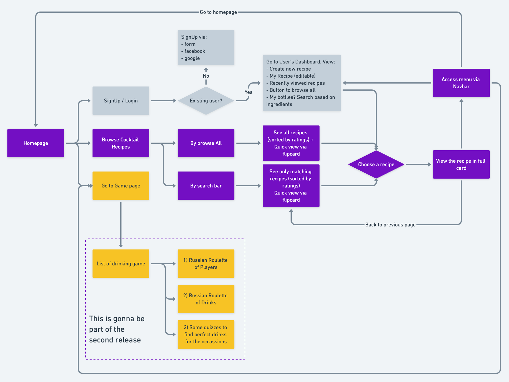

# Scotch 'n Vermouth V.2.0

This is an enhanced version of [Scotch 'n Vermouth V.1](http://scotch-n-vermouth.herokuapp.com/).

## Additional Features
- Full homepage design
- Responsive page
- Card hover effect
- Drinking games
- AJAX Search
- Allow login for returning user + their favorite recipe
- API for the recipe?

## [User Flow](https://whimsical.com/7ptA8YBSFaAKE24fPPAyam#2Ux7TurymN46Cvf7MAn1)

## DB Schema

## Tools & Programming Languages
- Ruby on Rails
- HTML/CSS with vanilla Bootstrap
- Vanilla JS/ES6
- Heroku as a host

